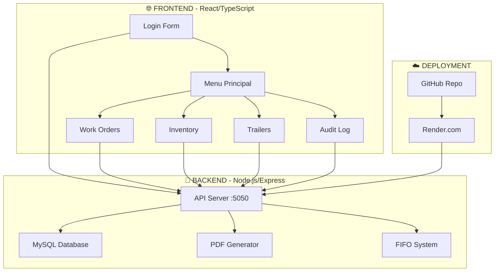
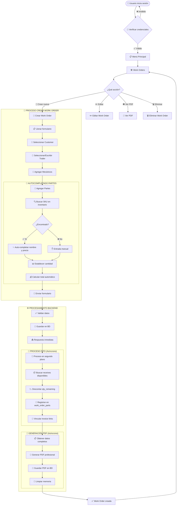
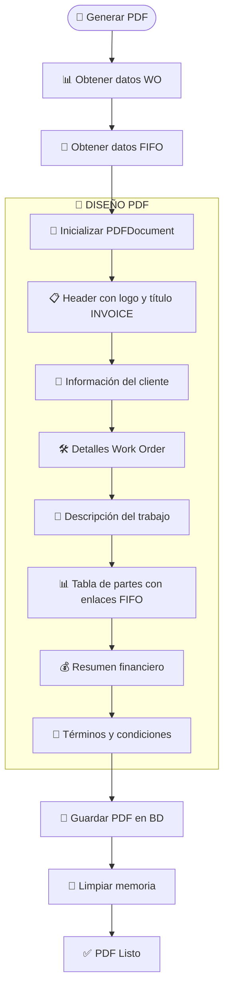
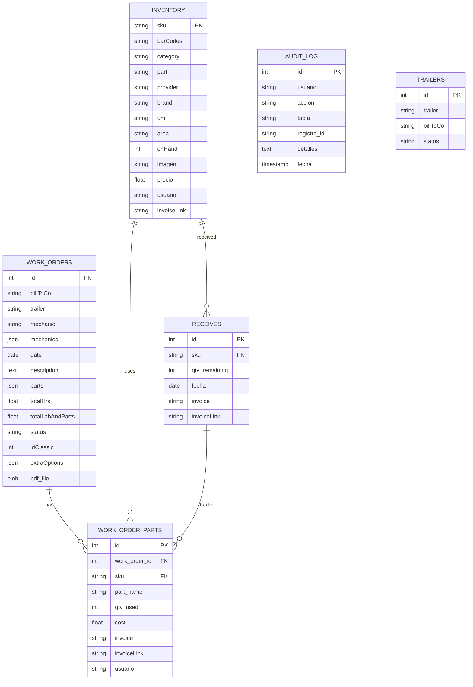
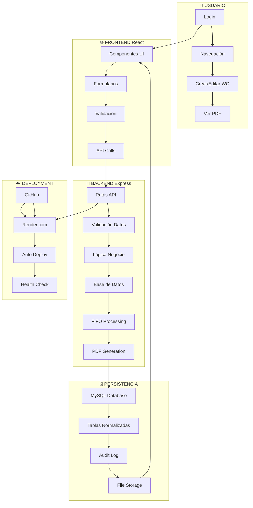
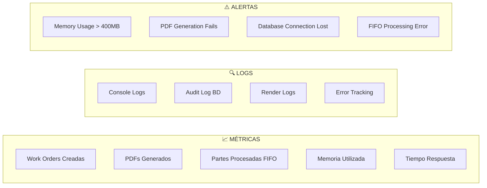

# 🏗️ DIAGRAMA DE FLUJO DEL SISTEMA JET SHOP

## 📋 ARQUITECTURA GENERAL



## 🔄 FLUJO PRINCIPAL - WORK ORDERS



## 📦 FLUJO SISTEMA FIFO

```mermaid
flowchart TD
    StartFIFO([🔧 Parte agregada a WO]) --> CheckInventory[📦 Buscar en receives]
    CheckInventory --> HasStock{¿Hay stock disponible?}
    
    HasStock -->|✅ Sí| ProcessFIFO[🔄 Procesamiento FIFO]
    HasStock -->|❌ No| NoStock[⚠️ Sin stock - Solo registro]
    
    subgraph "🔄 PROCESAMIENTO FIFO"
        ProcessFIFO --> GetOldest[📅 Obtener receive más antiguo]
        GetOldest --> CalcDeduct[🔢 Calcular qty a descontar]
        CalcDeduct --> MinQty[📊 Min(qty_needed, qty_available)]
        MinQty --> UpdateReceive[📉 Actualizar qty_remaining]
        UpdateReceive --> RegisterPart[📝 Registrar en work_order_parts]
        RegisterPart --> StillNeeded{¿Aún necesita más qty?}
        StillNeeded -->|✅ Sí| GetOldest
        StillNeeded -->|❌ No| CompleteFIFO[✅ FIFO Completado]
    end
    
    NoStock --> RegisterOnly[📝 Solo registrar sin descuento]
    RegisterOnly --> CompleteFIFO
    CompleteFIFO --> PDFGeneration[📄 Incluir en PDF con links]
```

## 📄 FLUJO GENERACIÓN PDF



## 🔍 FLUJO AUTOCOMPLETADO

```mermaid
flowchart TD
    TypeSKU[⌨️ Usuario escribe SKU] --> SearchInv[🔍 Buscar en inventario]
    SearchInv --> ExactMatch{¿Coincidencia exacta?}
    
    ExactMatch -->|✅ Sí| UseExact[✨ Usar coincidencia exacta]
    ExactMatch -->|❌ No| PartialMatch{¿Coincidencia parcial?}
    
    PartialMatch -->|✅ Sí| UsePartial[⚠️ Usar coincidencia parcial]
    PartialMatch -->|❌ No| NoMatch[❌ Sin coincidencias]
    
    UseExact --> ExtractData[📊 Extraer datos parte]
    UsePartial --> ExtractData
    
    subgraph "📊 EXTRACCIÓN DATOS"
        ExtractData --> GetName[📝 part || description || name]
        GetName --> GetPrice[💰 precio || cost || price]
        GetPrice --> FormatCost[🔢 Formatear costo a 2 decimales]
    end
    
    FormatCost --> AutoFill[✨ Auto-llenar campos]
    AutoFill --> Visual[💚 Feedback visual verde]
    NoMatch --> Manual[✋ Entrada manual requerida]
```

## 🗄️ ESTRUCTURA BASE DE DATOS



## 🔄 FLUJO COMPLETO SISTEMA



## ⚡ OPTIMIZACIONES MEMORIA

```mermaid
flowchart TD
    MemStart([⚠️ Problema Memoria 512MB]) --> Opt1[🔧 Node.js Flags]
    Opt1 --> Opt2[📄 PDF Buffer Cleanup]
    Opt2 --> Opt3[⏱️ setImmediate vs setTimeout]
    Opt3 --> Opt4[🔄 Keep-alive Deshabilitado]
    Opt4 --> Opt5[🗑️ Garbage Collection]
    Opt5 --> Result[✅ Memoria Optimizada]
    
    subgraph "🔧 OPTIMIZACIONES APLICADAS"
        NodeFlags[--max-old-space-size=400<br/>--optimize-for-size]
        BufferClean[chunks.length = 0<br/>after PDF generation]
        SetImm[setImmediate()<br/>mejor gestión memoria]
        NoKeepAlive[Keep-alive OFF<br/>reduce requests]
        GC[global.gc()<br/>si disponible]
    end
```

## 📊 MÉTRICAS Y MONITOREO



---

## 🎯 RESUMEN FLUJOS PRINCIPALES

1. **🔐 Autenticación** → Login → Verificación → Acceso al sistema
2. **📝 Crear WO** → Formulario → Autocompletado → Validación → BD → FIFO → PDF
3. **🔧 Sistema FIFO** → Buscar stock → Descontar → Registrar → Vincular invoices
4. **📄 PDF Generation** → Datos → Diseño profesional → Guardar → Cleanup memoria
5. **💾 Persistencia** → MySQL normalizado → Audit log → File storage
6. **☁️ Deployment** → GitHub → Render → Auto-deploy → Health checks

**🚀 El sistema está completamente integrado con optimizaciones de memoria y flujos automatizados!**
